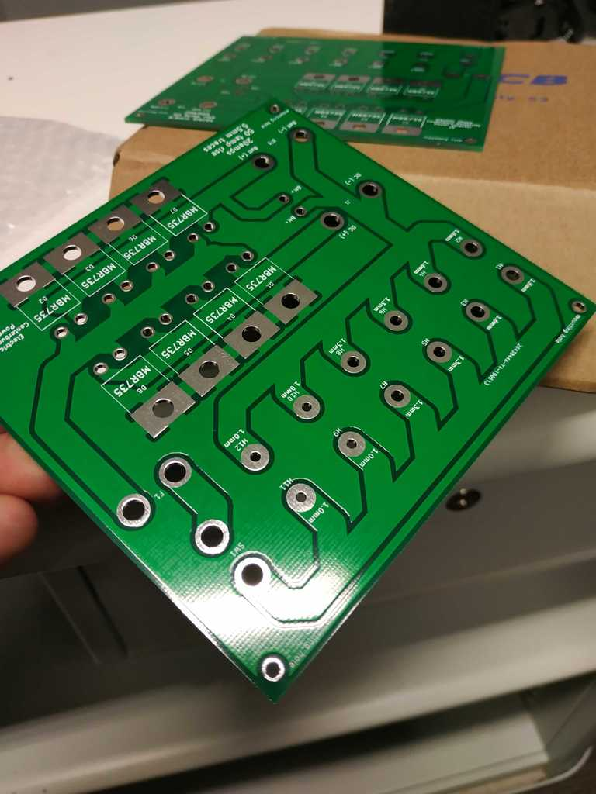

# Design (PCB)

When testing our motors (sometime before the initial qualification for RC 19)
we discovered that the arm motors in particular were very power hungry. A 3 or
4 amp power supply could not even get them to move. Testing them on a 10 amp
bench power supply on the other hand delivered very solid torque. Observing the
power supply we saw that each motor could easily draw 3 amps when performing
some action under load and we ran under the assumption that not every motor
would be under full load all of the time (as the mass of the robot could be
spread across several motors). We came to a number of 10 amps budget for the 6
arm motors. Given the increased efficiency of the leg motors and considering
the fact there are 10 of them, we also assumed that 10 amps was potentially a
suitable budget. Given the need to power the main board, fans, etc, as well as
having a comfortable overhead to use, we came at a number of 30 amps supply -
but we don't believe our system will ever reach this.

We had the following requirements of the power PCB:

1. Switch between battery supply (4 cell) and DC power supply
2. Battery should not be depleted before a match
3. Battery and DC supplies should be sufficiently isolated
4. Heat generated should be distributed over a reasonable area (our chassis
begins to warp at 80 degrees)
5. The system should be fused (in our case at 20 amps)
6. Circuit should be simple and easy to understand for non-electrical persons
7. Ability to detect low battery voltage and warn the robot handler
8. The output should be greater than 12V (by some margin) to allow for suitable
step-down further on in the system (in our case, 12V for smart motors, 5V PWM
motors and 5V for mainboard logic)

With these requirements, we came to the following circuit:

The traces can reasonably be expected to pass 30A through them, the diodes each
deliver 7 camps and the whole system is fused to 20A.

## Components

We provide the Gerber files in the source that can be sent to a PCB
manufacturer. The entire board was designed and built in KiCAD as an open
source PCB editor (the tutorials/support is very good). In order to build this
PCB you will need:

* Power cable with a suitable AWG rating (we found that automotive/marine 25A
cable is quite good - best to be sourced locally rather than online)
* [Diodes](https://www.jaycar.co.nz/diode-mbr735-schottky-35v-7a-to-220-2/p/ZR1029)
* [Power switch](https://www.banggood.com/2Pin-15A-250V-AC20A-125V-AC-Gas-Generator-Kill-Stop-Run-Switch-Fr-Wen-Power-Pro-p-1242672.html)
* [Fuse holder](https://www.banggood.com/Waterproof-Fuse-Holder-Socket-Blade-Type-In-Line-6-32V-with-10152030A-Replacement-Fuses-p-916113.html)
* [Battery connector](https://www.banggood.com/5Pcs-30cm-Battery-ESC-XT60-Plug-Extension-Wire-Cable-Male-Female-p-1090915.html)
* [DC connector](https://www.banggood.com/10pcs-5_5-x-2_1mm-DC-Power-Supply-Female-Jack-Socket-p-1062018.html)
* [Battery monitor](https://www.banggood.com/2-6S-Lipo-Battery-Low-Voltage-Tester-Buzzer-Alarm-For-RC-Model-p-1213452.html)

Additionally, we found
[this](https://www.banggood.com/96W-Universal-AC-Adapter-Power-Supply-Charger-Cord-For-Laptop-Notebook-p-1131283.html)
was a reasonably good cheap DC power supply.

## Discussion

The power PCB acted exactly as designed, we have zero complaints about it's
ability to safely deliver power to our system. At one point we decided to
over-volt our motors (thereby increasing current draw and heat), with no known
issues found in the power OCB, despite acting outside of the design parameters.
We are very confident in the simplicity of the design.

One flaw with the design is that the back plane isn't used as a heat
distribution plane, but this actually wasn't an issue as the board was cool
throughout with zero cooling. Making better use of the backside of the
two-layer PCB could have helped reduce the size of the PCB.
